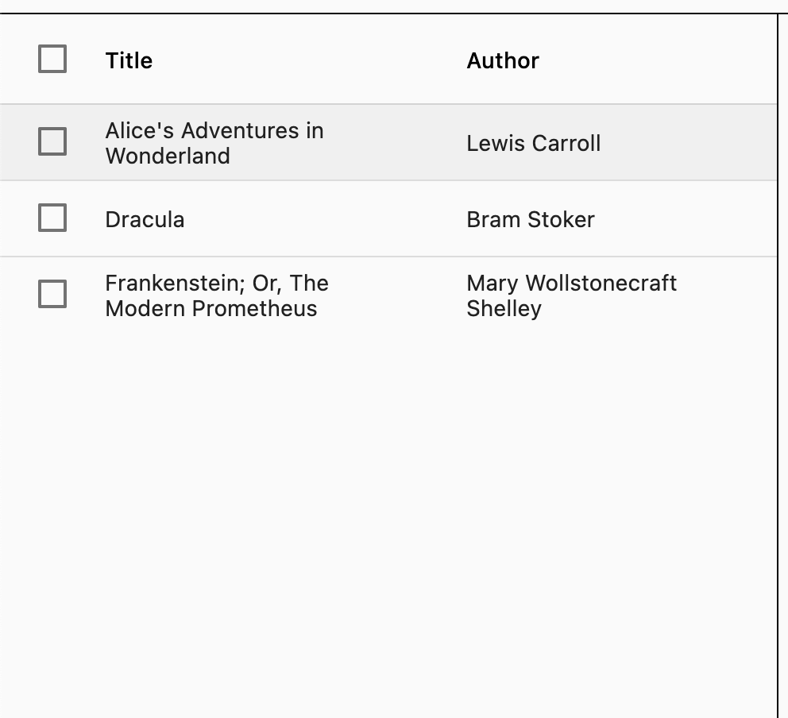
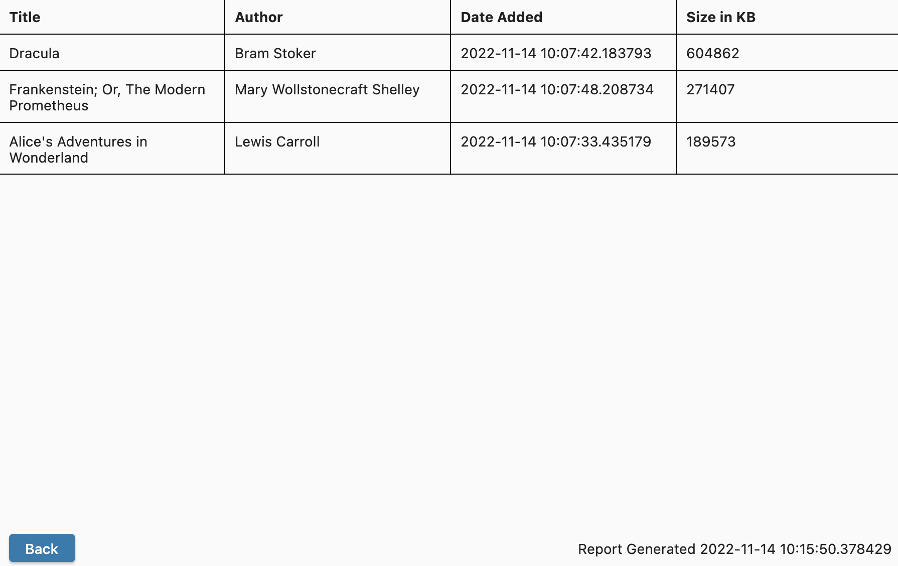

# User Guide
## Introduction
This user guide includes instructions on how to install and use the ebook management software.

## Installation
1. Download the the release for your operating system from [here]{here}
2. To run the program, double click on the downloaded binary

## Using the Application
There are three main areas in this application. The toolbar:

The book table:

{ width=50% }

And the book details:

{ width=50% }

### Logging In
The default username is "admin" and the default password is "password"

### Adding Books
1. Click the "plus" symbol in the toolbar of the application and select a .epub file to add to the library. A number of sample copyright-free epubs are provided with the submission of this capstone in the "ebooks.zip" file, or they can be found at [https://idpf.github.io/epub3-samples/30/samples.html]( https://idpf.github.io/epub3-samples/30/samples.html ).
2. The books will appear in the table, clicking on a book will show the cover and more information to the right

### Deleting Books
1. Select the books you want to delete by ticking the checkmark next to each book in the table
2. Press the "trash" icon in the top toolbar to delete the selected books

### Filtering Books
You can filter by either author or title

1. Select the search filter you want from the dropdown button in the toolbar
2. Enter either the title or author you want to search for in the search bar
3. Press enter to search
4. To reset the search, delete the contents of the search box and press enter

### Sorting Books
To sort the table by either title or author, click the corresponding header in the table

### Generating a Report
To generate a report of more detailed information on the books, click the "Generate Report of Books" button in the top toolbar

